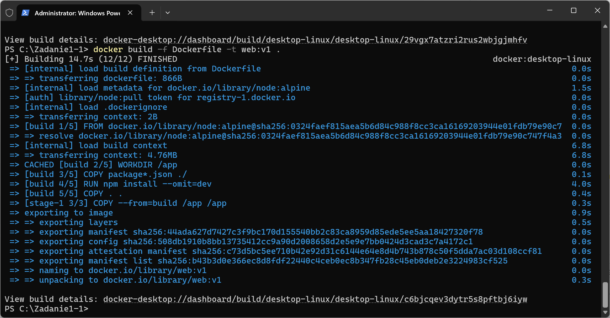
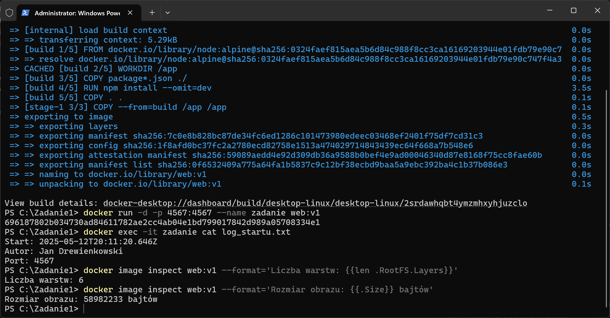
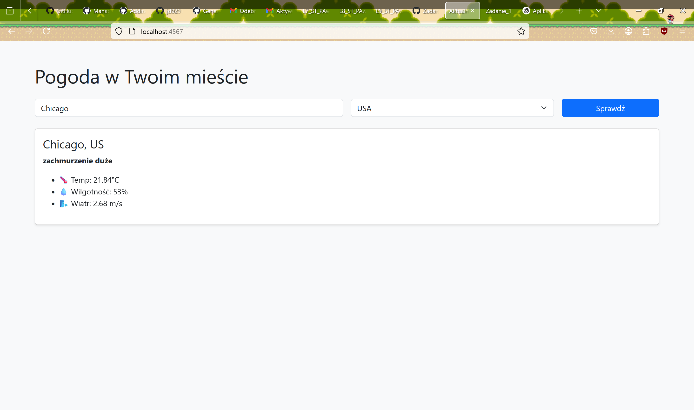

# Zadanie1
## Część obowiązkowa
### 1.Budowanie obrazu kontenera: 
```bash
docker build -f Dockerfile -t web:v1 .
```

### 2.Uruchomienie kontenera: 
```bash
docker run -d -p 4567:4567 --name zadanie web:v1
```
### 3.Informacje z logów uruchomieniowych: 
```bash
docker exec -it zadanie cat log_startu.txt
```
### 4.Liczba warstw i rozmiar obrazu: 
```bash
docker image inspect web:v1 --format='Liczba warstw: {{len .RootFS.Layers}}' 
docker image inspect web:v1 --format='Rozmiar obrazu: {{.Size}} bajtów'
```

### 5.Działanie aplikacji

### 6.Link do DockerHub
(https://hub.docker.com/repository/docker/jdrew589/zadanie1_jd/general)
# Zadanie 2
